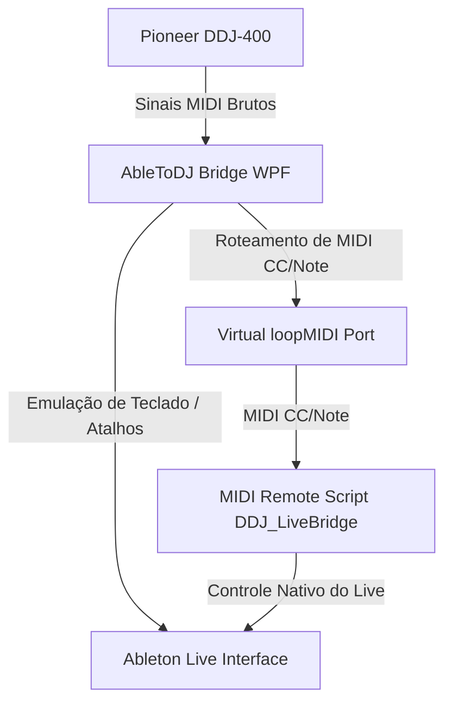
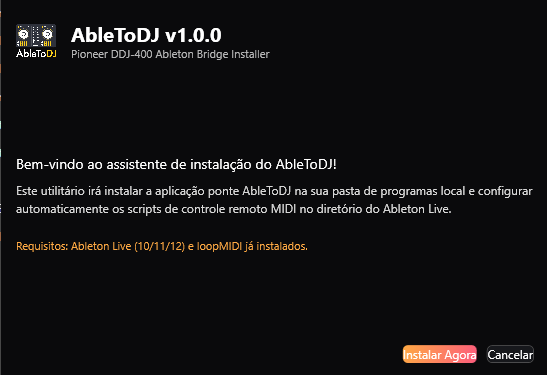
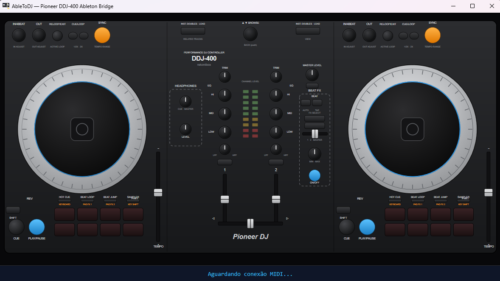
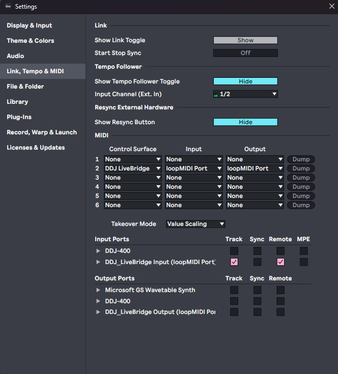

# AbleToDJ — Pioneer DDJ-400 Ableton Bridge


[](https://github.com/marentropico/abletonDDJ/releases/tag/v1.0.1)
[](https://github.com/marentropico/abletonDDJ/releases/download/v1.0.1/AbleToDJ_Installer.exe)
[](https://github.com/marentropico/abletonDDJ/releases/download/v1.0.1/AbleToDJ_Installer.exe)
[](https://marentropico.github.io/abletonDDJ)

**AbleToDJ** é uma ponte de integração avançada (WPF + MIDI + Python) que permite mapear e controlar o **Ableton Live** utilizando a controladora **Pioneer DDJ-400**. O projeto transforma a DDJ-400 em um dispositivo de performance física definitivo para DJs e produtores dentro do Ableton Live, combinando comandos nativos de scripts remotos, emulação inteligente de teclado e roteamento de sinal MIDI.

---

## 🌟 Funcionalidades Principais

* 🎛️ **Mixer & EQ Físicos Completos:** Mapeamento tátil dos botões de Trim, EQs (High, Mid, Low) e Filter para ambos os decks, integrando controle fino de ganho e frequência.
* 🎧 **Navegação e Workflow Integrados:** Use o seletor rotativo (`Browse Encoder`) para rolar pelas faixas e pastas do Ableton e clique para carregar ou abrir.
* 🎚️ **Controle de BPM e Timeline:** Slider de Pitch/Tempo associado ao controle de BPM do Ableton e jog wheels físicos para controle preciso de Zoom no Arrangement e needle drop.
* 🎹 **Modos dos Performance Pads:**
  * **Hot Cue:** Teclado cromático linear — 16 pads cobrem uma oitava completa cromaticamente (C→D#, E→G, G#→B, C+1→D#+1). Oitava herdada do modo Sampler.
  * **Sampler:** Teclado musical cromático de duas mãos com **layout de piano** — notas naturais na linha de baixo, sustenidos na linha de cima, e controle de oitava dinâmico nos Pads 4 e 8 do deck direito.
  * **Beat Loop & Beat Jump:** Controle e manipulação física de loops de forma nativa e momentânea.
* ⌨️ **Simulador de Atalhos de Teclado:** Ações automatizadas enviadas ao sistema operacional como Duplicar Clipe, Deletar, Undo/Redo, Quantizar e ligar/desligar Metrônomo.
* 💻 **Interface Visual Interativa (WPF):** Painel gráfico limpo que simula a superfície física da DDJ-400 e mostra o mapeamento ativo em tempo real.

---

## 📐 Arquitetura do Sistema

O projeto é dividido em três camadas principais:



1. **LiveBridge.App (C# / WPF):** O aplicativo principal que monitora os inputs da controladora via MIDI, processa emulações de teclas e traduz sinais contínuos/sensíveis ao toque.
2. **DDJ_LiveBridge (Python):** O Script Remoto nativo do Ableton Live que roda em segundo plano na User Library, interpretando comandos da ponte por meio do loopMIDI.
3. **Inno Setup Installer:** Instalador nativo Windows (~2.75 MB) que empacota a aplicação e configura os Remote Scripts nas pastas corretas do sistema, com registro de desinstalação no Painel de Controle.

---

## 📸 Demonstração Visual

### Assistente de Instalação Automatizado
O instalador copia o programa ponte para o seu diretório local (`AppData\Local\AbleToDJ`), cria atalhos de acesso e implanta automaticamente os scripts Python na User Library do seu Ableton Live.



### O Painel Ponte do AbleToDJ
Uma interface de estúdio completa no seu desktop para monitorar comandos, recalibrar sensores de toque e gerenciar as portas de entrada e saída.



### Configuração no Ableton Live
Basta selecionar a superfície de controle **DDJ_LiveBridge** e configurar as portas de entrada/saída associadas ao loopMIDI.



---

## ⚡ Pré-requisitos

* **Sistema Operacional:** Windows 10 ou 11 (64 bits).
* **Hardware:** Controladora Pioneer DDJ-400 conectada via USB.
* **Softwares:**
  * **Ableton Live** 10, 11 ou 12 instalado.
  * **loopMIDI** instalado e com uma porta chamada `"loopMIDI Port"` ativa para efetuar a ponte virtual.

---

## 🚀 Instalação Rápida

1. Baixe o instalador compilado **`AbleToDJ_Installer.exe`** diretamente na raiz do projeto.
2. Execute o instalador (caso necessário, execute como Administrador para criação de atalhos e diretórios na pasta de Documentos).
3. Aguarde o fim da extração e certifique-se de que a caixa de seleção para iniciar o AbleToDJ está marcada.
4. Abra o **Ableton Live**, acesse as preferências de MIDI e ative a superfície de controle **DDJ_LiveBridge** nas portas do loopMIDI.
5. Divirta-se!

---

## 🛠️ Compilação Manual

Se preferir compilar o projeto do zero, execute o script em PowerShell na raiz:

```powershell
.\Build-Installer.ps1
```
Esse script compilará a aplicação WPF com compilação nativa ReadyToRun, gerará os pacotes compactados dos recursos e criará um único executável autônomo do instalador na raiz do projeto.

---

## 📄 Licença

Este projeto é desenvolvido para fins didáticos e uso profissional de performance de DJ no Ableton Live. Sinta-se livre para estender, mapear novos botões e contribuir!
